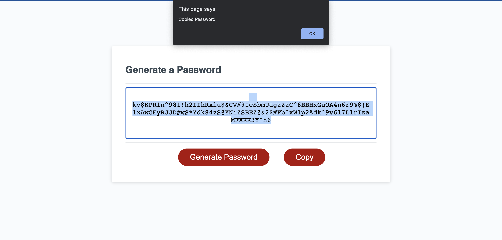

# Password Generator

## Introduction

Create an application that generates a random password based on user-selected criteria. This app will run in the browser and feature dynamically updated HTML and CSS powered by your JavaScript code. It will also feature a clean and polished user interface and be responsive, ensuring that it adapts to multiple screen sizes.


## Code Samples
DOM METHOD
Prompts Alerts confirms

If-else statements and For loops:
```
 var all = uppercase + lowercase + numbers + special;
    var a = uppercase + lowercase + numbers;

 if ((confLower === true) && (confUpper === true) && (confNum === true) && (confSpecial === true)) {
        for (i = 0; i < passlength; i++) {
            char = Math.floor(Math.random() * all.length);
            generatedPassword += all.charAt(char, char + 1);
        }
    } else if ((confLower === true) && (confUpper === true) && (confNum === true) && (confSpecial === false)) {
        for (i = 0; i < passlength; i++) {
            char = Math.floor(Math.random() * a.length);
            generatedPassword += a.charAt(char, char + 1);
        }

```
Random character:
```
for (i = 0; i < passlength; i++) {
            char = Math.floor(Math.random() * a.length);
            generatedPassword += a.charAt(char, char + 1);
```
Copy button:
```
function copy(){
    var copyText = document.querySelector("#password");
    copyText.select();
    document.execCommand("copy");
    alert("Copied Password");
    console.log(copyText);
};
```

# Link to deployed site: 

anasm23.github.io/PasswordGenerator/

# Screenshot:




